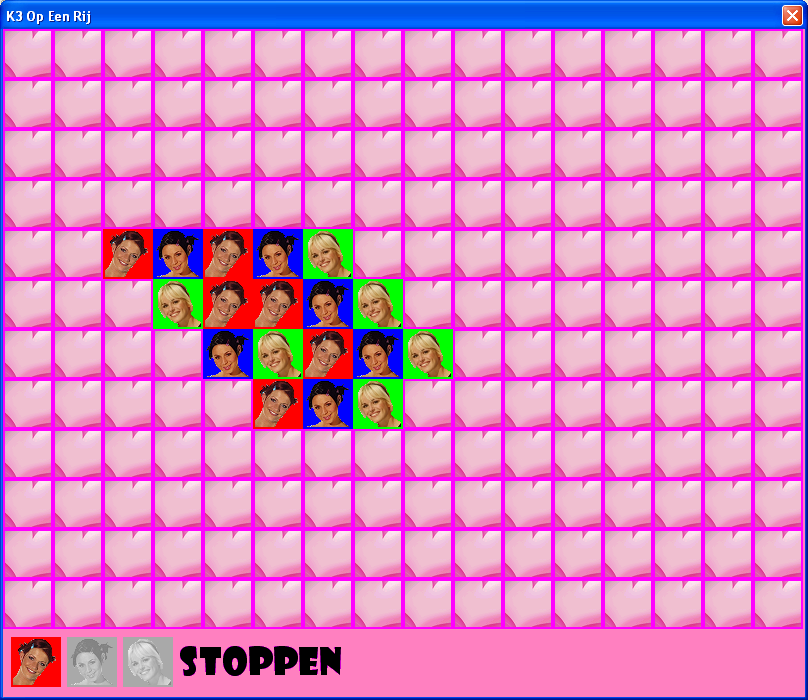

# K3-Op-Een-Rij (VCL)

K3-themed game of connect-three programmed in C++ using the VCL.

Current development is [at the K3OpEenRij GitHub](https://github.com/richelbilderbeek/K3OpEenRij).

Development for this game moved from the Windows-only VCL version 
to the cross-platform [K3OpEenRij](https://github.com/richelbilderbeek/K3OpEenRij) 
that uses the Qt and Wt libraries.

The K3 pictures are from Studio 100. I have sent them an email,
but never got a response.

# Screenshots

